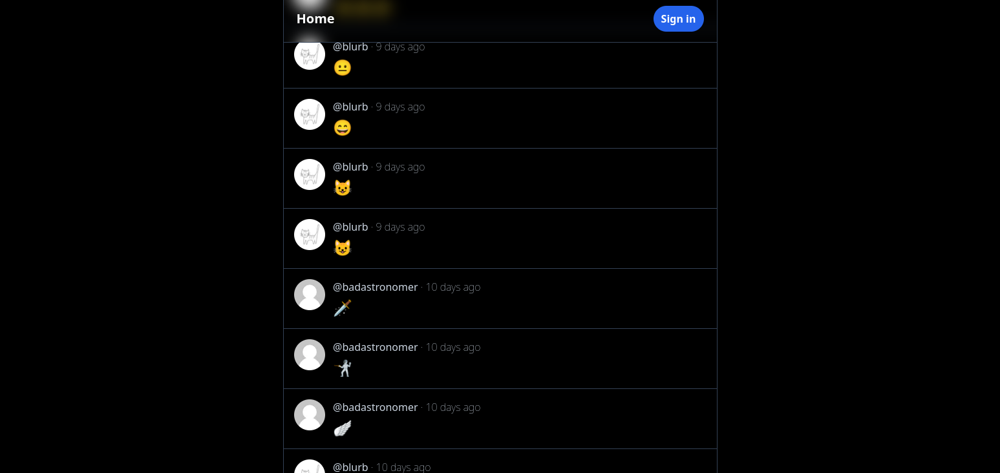
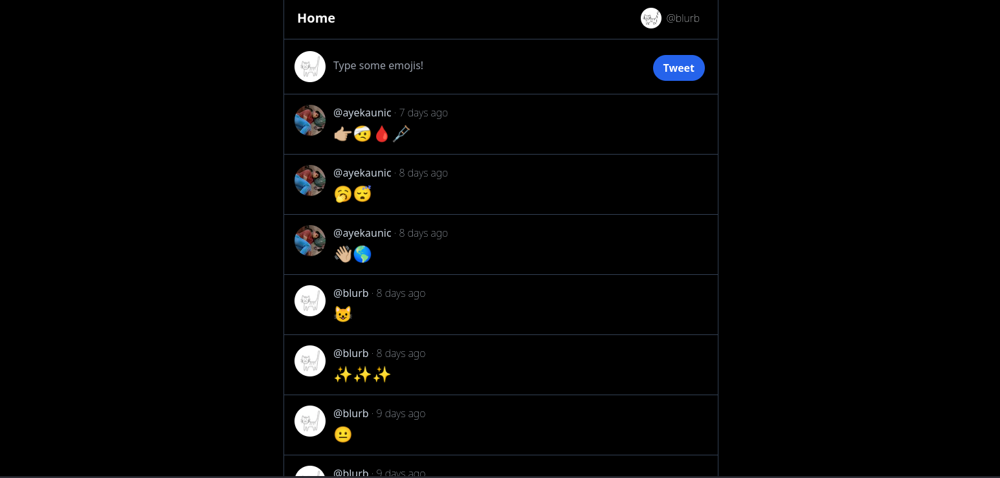
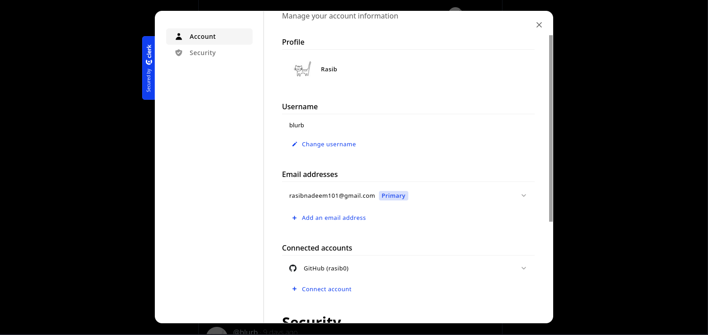

# Chirp

Chirp is a Twitter clone that allows users to express themselves exclusively through emojis in their tweets. The demo version of Chirp can be accessed [here](https://chirp-two-eta.vercel.app).



## Tech Stack

Chirp is built using the following technologies:

- Next.js: A React framework for building server-side rendered and static websites.
- Clerk.dev: An authentication solution for the web.
- Prisma: A modern database toolkit for TypeScript and Node.js that provides an ORM (Object-Relational Mapping) layer for database interactions.
- Tailwind CSS: A utility-first CSS framework that provides pre-built styles and components for rapid UI development.
- tRPC: A next-generation TypeScript API framework for building APIs with strong typing and automatic code generation.
- Redis: An in-memory data store used for rate limiting.



## Features

- User registration authentication and advanced management.
- Tweeting functionality with exclusive emoji usage.
- Use of SSG and SSR to improve performance and SEO.
- Timeline to view and interact with tweets from other users.
- User profile page with full tweet history
- Rate limiting using Redis to prevent excessive API requests.

## Getting Started

To get started with Chirp, follow these steps:

1. Clone the repository:

   ```bash
   git clone https://github.com/your-username/chirp.git
   ```

2. Install the dependencies:

   ```bash
   cd chirp
   npm install
   ```

3. Set up the environment variables:
   - Create a `.env` file in the root directory of the project.
   - Define the required environment variables in the `.env` file, such as database connection details, API keys, and Redis configuration.

4. Run the development server:

   ```bash
   npm run dev
   ```

   The Chirp application should now be running on [http://localhost:3000](http://localhost:3000).



## License

This project is licensed under the [MIT License](LICENSE). Feel free to use and modify the code as per your requirements.

## Acknowledgements

- [Next.js Documentation](https://nextjs.org/docs)
- [Clerk.dev Documentation](https://clerk.dev)
- [Prisma Documentation](https://www.prisma.io/docs)
- [Tailwind CSS Documentation](https://tailwindcss.com/docs)
- [tRPC Documentation](https://trpc.io/docs)
- [Redis Documentation](https://redis.io/documentation)


---

